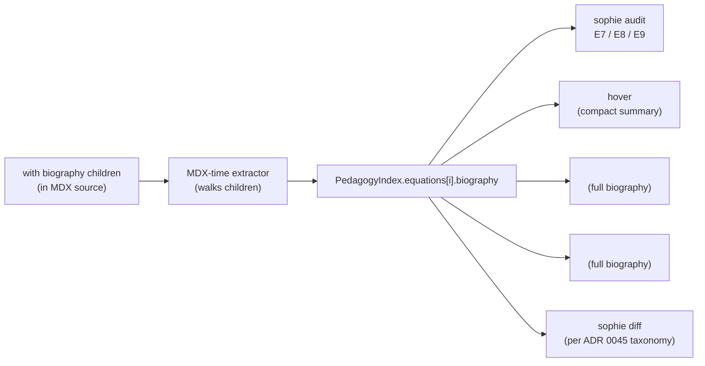

# Equation Biography schema

This page is the full schema specification for the Equation
Biography extension to `<KeyEquation>`. The authoring decision +
rationale + alternatives considered live in
[ADR 0046](../decisions/0046-equation-biography.md). This page
covers what authors write, what the audit checks, and what the
three render surfaces show.

## Quick-start example

```mdx
<KeyEquation id="wiens-law" title="Wien's Law">
  $$\lambda_{peak} = b \, T^{-1}$$

  <Observable>
    Peak wavelength of thermal emission as a function of
    temperature.
  </Observable>

  <Assumption type="thermal-equilibrium">
    Source is in local thermodynamic equilibrium so the Planck
    distribution applies.
  </Assumption>

  <Assumption type="blackbody">
    Source emits as an ideal blackbody.
  </Assumption>

  <Units symbol="T" unit="K" />
  <Units symbol="\lambda_{peak}" unit="cm" />

  <BreaksWhen>
    Non-thermal emission (synchrotron, masers, line emission).
  </BreaksWhen>

  <CommonMisuse misconception="wiens-law-absorption-spectra">
    Applying Wien's law to identify the temperature of an
    absorption-line spectrum.
  </CommonMisuse>
</KeyEquation>
```

A `<KeyEquation>` with no biography children is also valid — the
existing PR-C2 behavior (title + math body) is unchanged. Any
subset of biography children is valid; any field can repeat.

## The six biography children

### `<Observable>` (zero or one)

Prose. Describes what real-world quantity the equation captures.

| Attribute | Required | Notes |
|---|---|---|
| (none) | — | body-only |

```mdx
<Observable>
  Peak wavelength of thermal emission as a function of
  temperature.
</Observable>
```

**Audit:** When biography children are declared but `<Observable>`
is absent, E7 (INFO) fires. Not gated; chapter-author nudge toward
complete biographies.

### `<Assumption>` (zero or more)

Prose body. Declares an assumption the equation encodes.

| Attribute | Required | Notes |
|---|---|---|
| `type` | optional | Short slug naming the assumption type (e.g., `thermal-equilibrium`, `small-angle`, `non-relativistic`). Informational in v1; reserved for future cross-ref work once a platform catalog is justified by authoring data. |

```mdx
<Assumption type="small-angle">
  Parallax angle is small enough that tan(θ) ≈ θ in radians.
</Assumption>

<Assumption>
  Source can be approximated as a point in the sky plane.
</Assumption>
```

**Audit:** No v1 invariant. The `type=` slot validates as a string
when present but is not cross-referenced against a platform
catalog. v2 may promote recurring `type=` values to a platform
`assumption-index.ts` (mirroring `move-index.ts` + `intervention-
index.ts`) and add a corresponding audit invariant at that time.

### `<Units>` (zero or more)

Empty-body. Declares the unit of one symbol.

| Attribute | Required | Notes |
|---|---|---|
| `symbol` | required | The symbol as it appears in the math body (KaTeX-compatible; e.g., `T`, `\lambda_{peak}`, `M_\odot`). |
| `unit` | required | The unit string (e.g., `K`, `cm`, `M_\odot`, `cm/s^2`). Prefer CGS for physics per Sophie's units convention. |

```mdx
<Units symbol="T" unit="K" />
<Units symbol="\lambda_{peak}" unit="cm" />
<Units symbol="L" unit="erg/s" />
```

**Audit:** When the Notation Registry is opted-in via
`pedagogy-contract.yaml.math_and_units_standards.notation_registry:
true` (per ADRs 0042 + 0043), **E8 (WARNING)** fires if `symbol`
doesn't match any `canonical_symbol` or `alias` in the registry
for the concept that owns this equation. The correctness gate of
the family. When NR is opt-out, E8 doesn't fire.

### `<BreaksWhen>` (zero or one)

Prose. Describes the regime where the equation no longer applies.

| Attribute | Required | Notes |
|---|---|---|
| (none) | — | body-only |

```mdx
<BreaksWhen>
  Non-thermal emission (synchrotron, masers, line emission);
  optically-thin sources without thermal coupling.
</BreaksWhen>
```

**Audit:** No v1 invariant. Future ADRs may add an INFO-tier nudge
for declaring `<BreaksWhen>` when biography is otherwise present.

### `<CommonMisuse>` (zero or more)

Prose body. Describes a common student misuse pattern.

| Attribute | Required | Notes |
|---|---|---|
| `misconception` | optional | Slug referencing a `<Aside kind="misconception">` in the misconception graph (per ADR 0044). Establishes a cross-reference from the equation into the A5 graph. |

```mdx
<CommonMisuse misconception="wiens-law-absorption-spectra">
  Applying Wien's law to identify the temperature of an absorption-
  line spectrum. The peak position depends on the continuum, not
  the absorption features.
</CommonMisuse>

<CommonMisuse>
  Using λ_peak as a sole indicator of source temperature without
  considering instrument bandpass effects.
</CommonMisuse>
```

**Audit:** When `<CommonMisuse>` lacks a `misconception=` cross-
ref, **E9 (INFO)** fires. Not gated; soft suggestion toward
curriculum coherence. The cross-ref is bidirectional: misconception
graph walkers can identify which equations are linked to each
misconception.

## The three audit invariants

| ID | Level | Triggers |
|---|---|---|
| **E7** | INFO | `<KeyEquation>` declares at least one biography child but lacks `<Observable>`. Chapter-author nudge. |
| **E8** | WARNING | `<Units symbol="X">` symbol doesn't match any `canonical_symbol` or `alias` in NR for the equation's concept. Fires only when NR is opted-in. Correctness gate. |
| **E9** | INFO | `<CommonMisuse>` lacks `misconception="<slug>"` cross-ref. Soft curriculum-coherence suggestion. |

All three invariants only fire **when biography children are
present**. Non-biography-using `<KeyEquation>` blocks see no new
audit lines. Combined with the prose-only stance for non-`<Units>`
children, this means non-STEM courses that use `<KeyEquation>` for
the rare equation (history of science, statistics, etc.) incur no
audit pressure to author biography.

The invariants extend the existing PR-C2 E-prefix family
(E1 title-required, E4 unresolved-EqRef, E6 unused-eq). The
namespace coherence preserves the rule "E-prefix governs
`<KeyEquation>`."

## The three rendering surfaces

The three surfaces already exist for plain `<KeyEquation>`. The
biography schema changes the *render layer* of each.

### Surface 1: `<EqRef>` hover (compact summary)

When a reader hovers an inline `<EqRef slug="wiens-law">`, the
hover card shows:

```text
┌─────────────────────────────────────────┐
│ Wien's Law                              │
│ $$λ_peak = b T⁻¹$$                      │
│ 2 assumptions · 1 misuse                │
│ valid in: thermal equilibrium           │
└─────────────────────────────────────────┘
```

**Compact summary content:**

- Title (PR-C2; unchanged).
- KaTeX-rendered math (PR-C2; unchanged).
- New: a single summary line listing biography counts.
  - Number of `<Assumption>` children (or omit if zero).
  - Number of `<CommonMisuse>` children (or omit if zero).
- New: if the first `<Assumption>` has a non-empty `type=` slot,
  a "valid in: ⟨type⟩" line. Omit if no `<Assumption>` has `type=`.

The hover does not render full biography bodies — that's the
chapter-end / `/library/equations` surfaces' job. The hover is a tooltip;
keeping it compact preserves its function.

### Surface 2: `<ChapterEquations chapter="X">` (full biography)

The end-of-chapter equations roll-up renders one block per
equation in the chapter. Post-A7, each block expands:

```text
## Wien's Law
$$λ_peak = b T⁻¹$$

**Observable:** Peak wavelength of thermal emission as a
function of temperature.

**Assumptions:**
- thermal-equilibrium — Source is in local thermodynamic
  equilibrium so the Planck distribution applies.
- blackbody — Source emits as an ideal blackbody (no spectral
  lines, no continuum absorption shaping the peak).

**Units:** T [K], λ_peak [cm]

**Breaks when:** Non-thermal emission (synchrotron, masers,
line emission); optically-thin sources without thermal coupling.

▸ Common misuses (1)   [collapsed]
```

The `<CommonMisuse>` list is rendered behind a `<details>`
disclosure. Other biography fields are always-visible. Rendering
order is fixed: Observable → Assumptions → Units → BreaksWhen →
CommonMisuses (mirrors the recommended source-authoring order).

### Surface 3: `<CourseEquations />` at `/library/equations`

Renders every `<KeyEquation>` across the course, applying the same
full-biography rendering as Surface 2. Each equation block links
back to its source chapter via the existing `<ChapterRef>`
infrastructure (per PR-C4).

A future ADR ("Equation Pages") may add dedicated `/library/equations/
<slug>` per-equation pages with reverse-lookups (which chapters
cite this, which misconceptions pair with it, what other equations
share assumptions). The biography schema this page establishes is
the prerequisite; the per-equation page is a separate concern.

## Authoring guidance

**Start with `<Observable>`.** If you author any biography fields
for an equation, lead with what it observes. The compact hover
summary, the chapter-end render, and the `/library/equations` route all
foreground Observable; E7 nudges chapter-authors toward declaring
it.

**Author `<Units>` together with the math body.** Units are the
most mechanical biography field and the most audit-leveraged
(E8 fires on them). When an equation has a Notation Registry
entry, `<Units symbol="X" unit="Y">` should match. Multiple
symbols → multiple `<Units>` children.

**Pair `<CommonMisuse>` with the misconception graph.** Each
`<CommonMisuse>` should ideally reference a `<Aside
kind="misconception">` slug. If the misconception doesn't exist
yet in the chapter, this is a signal to either author it (it's
real and recurring) or use `<CommonMisuse>` without `misconception=`
(it's idiosyncratic to this equation). E9 INFO surfaces both
cases without forcing either.

**Don't force biography fields you don't have signal for.** An
incomplete biography (`<Assumption>` and `<Units>` only, no
`<Observable>` or `<CommonMisuse>`) is a valid v1 authoring state.
E7 nudges toward `<Observable>` but doesn't gate. Adding
biography fields incrementally over multiple revisions is
expected.

**Notation Registry coupling.** `<Units>` is the only NR-cross-
referenced biography child. Other biography children
(`<Observable>`, `<Assumption>`, `<CommonMisuse>`, `<BreaksWhen>`)
are prose. If you need to reference an NR concept in the prose
body of any of those, do it inline as a Markdown link.

## How biography flows through the platform



Biography is data, like the rest of the pedagogy index. Once
extracted, it feeds every downstream consumer the index already
serves. No new data path; six new schema sub-shapes inside the
existing `equations` collection.

## TypeScript shape (post-code-PR)

The full Zod schema lives in `@sophie/core/schema/key-equation.ts`
once the code PR lands. Abbreviated TypeScript-style for reference:

```ts
type KeyEquationEntry = {
  id: string;
  title: string;
  math: string;             // the $$...$$ body
  chapter: string;
  anchor: string;           // canonical: `eq-${id}`

  // NEW in A7 (all optional):
  biography?: {
    observable?: string;
    assumptions?: AssumptionEntry[];
    units?: UnitsEntry[];
    breaks_when?: string;
    common_misuses?: CommonMisuseEntry[];
  };
};

type AssumptionEntry = {
  type?: string;            // optional slug; v1 informational
  body: string;             // prose
};

type UnitsEntry = {
  symbol: string;           // KaTeX-compatible
  unit: string;             // unit string (CGS preferred)
};

type CommonMisuseEntry = {
  misconception?: string;   // optional misconception slug (A5)
  body: string;             // prose
};
```

`biography` is a single optional aggregate field on the
`KeyEquationEntry`. Its absence is the universal "no biography"
case; its presence (with any subset of sub-fields) triggers the
new render surfaces and audit invariants.

## Migration

Pre-launch (no production students); no migration. Existing
`<KeyEquation>` blocks in `examples/smoke/` and any consumer-repo
chapters continue to render unchanged. Adding biography children
is purely additive.

Suggested incremental adoption for ASTR 201 Module 1: pick the
3–4 most pedagogically rich equations (Wien's law, Hubble–
Lemaître, inverse-square law, Stefan–Boltzmann), author full
biographies for them as worked examples, then propagate the
pattern to other equations as authoring time allows.

## References

- [ADR 0046 — Equation Biography](../decisions/0046-equation-biography.md) —
  the authoring decision; full rationale, alternatives, and
  consequences.
- [ADR 0038 — Pedagogy-index pattern](../decisions/0038-pedagogy-index-pattern.md) —
  where biography is stored; children-mode extractor pattern.
- [ADR 0042 — Pedagogy Contract + AI Contribution Ledger](../decisions/0042-pedagogy-contract-and-ai-contribution-ledger.md) —
  `math_and_units_standards.notation_registry` gates E8.
- [ADR 0043 — Notation Registry + MultiRep + Alignment Audit](../decisions/0043-notation-registry-multirep-alignment-audit.md) —
  `canonical_symbol`/`alias` source-of-truth for E8.
- [ADR 0044 — Misconception Graph + Intervention Library](../decisions/0044-misconception-graph-and-intervention-library.md) —
  misconception slugs that `<CommonMisuse misconception=…>`
  references.
- [ADR 0045 — Pedagogical Diff + Curriculum CI](../decisions/0045-pedagogical-diff-curriculum-ci.md) —
  biography changes classify under the existing two-axis diff
  taxonomy.
- [Chapter components reference](chapter-components.md) — the
  authoring surface where `<KeyEquation>` sits; biography
  children integrate as static (Astro-rendered) source components
  that feed the pedagogy index.
